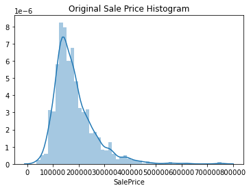
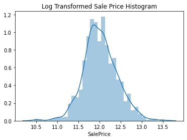
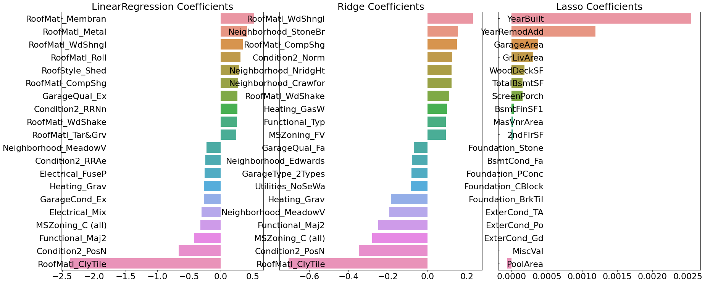
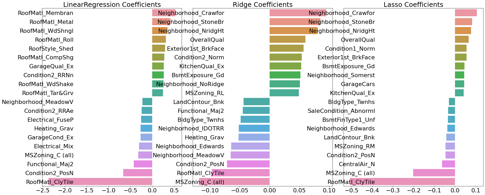
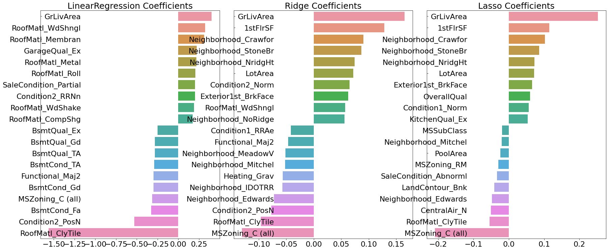
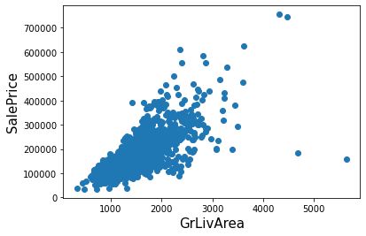
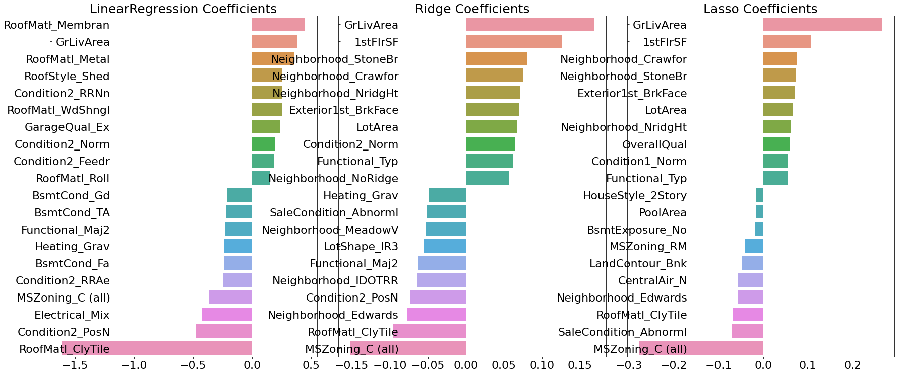
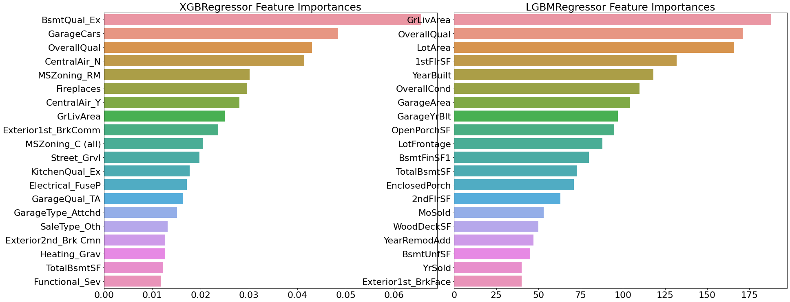

```python
#Data related package
import pandas as pd
import numpy as np
import seaborn as sns
import matplotlib.pyplot as plt
from scipy.stats import skew
%matplotlib inline
np.set_printoptions(formatter={'float_kind':lambda x : "{0:0.3f}".format(x)})

import warnings
warnings.filterwarnings("ignore", category=RuntimeWarning)

#sklearn package
from sklearn.model_selection import train_test_split, cross_val_score, GridSearchCV, KFold
from sklearn.preprocessing import StandardScaler, MinMaxScaler
from sklearn.ensemble import RandomForestRegressor
from sklearn.metrics import accuracy_score, roc_auc_score, mean_squared_error, mean_absolute_error
from sklearn.linear_model import LinearRegression, LogisticRegression, Ridge, Lasso, ElasticNet

#Ensemble package
from xgboost import XGBRegressor
from lightgbm import LGBMRegressor
```


```python
house_df_org = pd.read_csv("house_price.csv")
house_df = house_df_org.copy()
house_df.head(3)
```


<div>
<style scoped>
    .dataframe tbody tr th:only-of-type {
        vertical-align: middle;
    }

    .dataframe tbody tr th {
        vertical-align: top;
    }

    .dataframe thead th {
        text-align: right;
    }
</style>
<table border="1" class="dataframe">
  <thead>
    <tr style="text-align: right;">
      <th></th>
      <th>Id</th>
      <th>MSSubClass</th>
      <th>MSZoning</th>
      <th>LotFrontage</th>
      <th>LotArea</th>
      <th>Street</th>
      <th>Alley</th>
      <th>LotShape</th>
      <th>LandContour</th>
      <th>Utilities</th>
      <th>...</th>
      <th>PoolArea</th>
      <th>PoolQC</th>
      <th>Fence</th>
      <th>MiscFeature</th>
      <th>MiscVal</th>
      <th>MoSold</th>
      <th>YrSold</th>
      <th>SaleType</th>
      <th>SaleCondition</th>
      <th>SalePrice</th>
    </tr>
  </thead>
  <tbody>
    <tr>
      <th>0</th>
      <td>1</td>
      <td>60</td>
      <td>RL</td>
      <td>65.0</td>
      <td>8450</td>
      <td>Pave</td>
      <td>NaN</td>
      <td>Reg</td>
      <td>Lvl</td>
      <td>AllPub</td>
      <td>...</td>
      <td>0</td>
      <td>NaN</td>
      <td>NaN</td>
      <td>NaN</td>
      <td>0</td>
      <td>2</td>
      <td>2008</td>
      <td>WD</td>
      <td>Normal</td>
      <td>208500</td>
    </tr>
    <tr>
      <th>1</th>
      <td>2</td>
      <td>20</td>
      <td>RL</td>
      <td>80.0</td>
      <td>9600</td>
      <td>Pave</td>
      <td>NaN</td>
      <td>Reg</td>
      <td>Lvl</td>
      <td>AllPub</td>
      <td>...</td>
      <td>0</td>
      <td>NaN</td>
      <td>NaN</td>
      <td>NaN</td>
      <td>0</td>
      <td>5</td>
      <td>2007</td>
      <td>WD</td>
      <td>Normal</td>
      <td>181500</td>
    </tr>
    <tr>
      <th>2</th>
      <td>3</td>
      <td>60</td>
      <td>RL</td>
      <td>68.0</td>
      <td>11250</td>
      <td>Pave</td>
      <td>NaN</td>
      <td>IR1</td>
      <td>Lvl</td>
      <td>AllPub</td>
      <td>...</td>
      <td>0</td>
      <td>NaN</td>
      <td>NaN</td>
      <td>NaN</td>
      <td>0</td>
      <td>9</td>
      <td>2008</td>
      <td>WD</td>
      <td>Normal</td>
      <td>223500</td>
    </tr>
  </tbody>
</table>
<p>3 rows × 81 columns</p>
</div>


```python
print("데이터 세트의 Shape :", house_df.shape)
print("\n전체 피처의 type \n ", house_df.dtypes.value_counts())
isnull_series = house_df.isnull().sum()
print("\nNull 칼럼과 그 건수:\n", isnull_series[isnull_series > 0].sort_values(ascending=False))
```

    데이터 세트의 Shape : (1460, 81)
    
    전체 피처의 type 
      object     43
    int64      35
    float64     3
    dtype: int64
    
    Null 칼럼과 그 건수:
     PoolQC          1453
    MiscFeature     1406
    Alley           1369
    Fence           1179
    FireplaceQu      690
    LotFrontage      259
    GarageYrBlt       81
    GarageType        81
    GarageFinish      81
    GarageQual        81
    GarageCond        81
    BsmtFinType2      38
    BsmtExposure      38
    BsmtFinType1      37
    BsmtCond          37
    BsmtQual          37
    MasVnrArea         8
    MasVnrType         8
    Electrical         1
    dtype: int64
    


```python
plt.title('Original Sale Price Histogram')
sns.distplot(house_df['SalePrice'])
```


    <matplotlib.axes._subplots.AxesSubplot at 0x1b5f0c95ee0>





```python
plt.title('Log Transformed Sale Price Histogram')
log_SalePrice = np.log1p(house_df['SalePrice'])
sns.distplot(log_SalePrice)
```


    <matplotlib.axes._subplots.AxesSubplot at 0x1b5817615b0>





```python
original_SalePrice = house_df['SalePrice']
house_df['SalePrice'] = np.log1p(house_df['SalePrice'])

house_df.drop(['Id', 'PoolQC', 'MiscFeature', 'Alley', 'Fence', 'FireplaceQu'], axis=1, inplace=True)

house_df.fillna(house_df.mean(), inplace=True)
```


```python
null_column_count = house_df.isnull().sum()[house_df.isnull().sum()>0]
print('## Null 피처의 Type:\n', house_df.dtypes[null_column_count.index])
```

    ## Null 피처의 Type:
     MasVnrType      object
    BsmtQual        object
    BsmtCond        object
    BsmtExposure    object
    BsmtFinType1    object
    BsmtFinType2    object
    Electrical      object
    GarageType      object
    GarageFinish    object
    GarageQual      object
    GarageCond      object
    dtype: object
    


```python
print('get_dummies() 수행 전 데이터 Shape:', house_df.shape)
house_df_ohe = pd.get_dummies(house_df)
print('get_dummies() 수행 후 데이터 Shape:', house_df_ohe.shape)

null_column_count = house_df_ohe.isnull().sum()[house_df_ohe.isnull().sum() >0]
print('## Null 피처의 Type : \n', house_df_ohe.dtypes[null_column_count.index])
```

    get_dummies() 수행 전 데이터 Shape: (1460, 75)
    get_dummies() 수행 후 데이터 Shape: (1460, 271)
    ## Null 피처의 Type : 
     Series([], dtype: object)
    


```python
def get_rmse(model):
    pred = model.predict(x_test)
    mse = mean_squared_error(y_test, pred)
    rmse = np.sqrt(mse)
    print(model.__class__.__name__, '로그 변환된 RMSE:', np.round(rmse, 3))
    return rmse

def get_rmses(models):
    rmses = []
    for model in models:
        rmse = get_rmse(model)
        rmses.append(rmse)
    return rmses
```


```python
y_target = house_df_ohe['SalePrice']
x_features = house_df_ohe.drop('SalePrice', axis=1, inplace=False)
x_train, x_test, y_train, y_test = train_test_split(x_features, y_target, test_size = 0.2, random_state=156)

lr_reg = LinearRegression()
lr_reg.fit(x_train, y_train)
ridge_reg = Ridge()
ridge_reg.fit(x_train, y_train)
lasso_reg = Lasso()
lasso_reg.fit(x_train, y_train)

models = [lr_reg, ridge_reg, lasso_reg]
get_rmses(models)
```

    LinearRegression 로그 변환된 RMSE: 0.132
    Ridge 로그 변환된 RMSE: 0.128
    Lasso 로그 변환된 RMSE: 0.176
    


    [0.13189576579154055, 0.12750846334053145, 0.17628250556471395]


```python
def get_top_bottom_coef(model, n=10):
    coef = pd.Series(model.coef_, index=x_features.columns)
    
    coef_high = coef.sort_values(ascending=False).head(n)
    coef_low = coef.sort_values(ascending=False).tail(n)
    return coef_high, coef_low
```


```python
def visualize_coefficient(models):
    fig, axs = plt.subplots(figsize=(24, 10), nrows=1, ncols=3)
    fig.tight_layout()
    
    for i_num, model in enumerate(models):
        coef_high, coef_low = get_top_bottom_coef(model)
        coef_concat = pd.concat([coef_high, coef_low])
        
        axs[i_num].set_title(model.__class__.__name__+' Coefficients', size=25)
        axs[i_num].tick_params(axis="y", direction="in", pad=-120)
        for label in (axs[i_num].get_xticklabels() + axs[i_num].get_yticklabels()):
            label.set_fontsize(22)
        sns.barplot(x=coef_concat.values, y=coef_concat.index, ax = axs[i_num])

models = [lr_reg, ridge_reg, lasso_reg]
visualize_coefficient(models)
```





```python
def get_avg_rmse_cv(models):
    for model in models:
        # 분할하지 않고 전체 데이터로 cross_val_score( ) 수행. 모델별 CV RMSE값과 평균 RMSE 출력
        rmse_list = np.sqrt(-cross_val_score(model, x_features, y_target,
                                             scoring="neg_mean_squared_error", cv = 5))
        rmse_avg = np.mean(rmse_list)
        print('\n{0} CV RMSE 값 리스트: {1}'.format( model.__class__.__name__, np.round(rmse_list, 3)))
        print('{0} CV 평균 RMSE 값: {1}'.format( model.__class__.__name__, np.round(rmse_avg, 3)))
    
models = [lr_reg, ridge_reg, lasso_reg]
get_avg_rmse_cv(models)
```

    
    LinearRegression CV RMSE 값 리스트: [0.135 2467.683 0.168 0.111 0.198]
    LinearRegression CV 평균 RMSE 값: 493.659
    
    Ridge CV RMSE 값 리스트: [0.117 0.154 0.142 0.117 0.189]
    Ridge CV 평균 RMSE 값: 0.144
    
    Lasso CV RMSE 값 리스트: [0.161 0.204 0.177 0.181 0.265]
    Lasso CV 평균 RMSE 값: 0.198
    


```python
def print_best_params(model, params):
    grid_model = GridSearchCV(model, param_grid=params, 
                              scoring='neg_mean_squared_error', cv=5)
    grid_model.fit(x_features, y_target)
    rmse = np.sqrt(-1* grid_model.best_score_)
    print('{0} 5 CV 시 최적 평균 RMSE 값: {1}, 최적 alpha:{2}'.format(model.__class__.__name__,
                                        np.round(rmse, 4), grid_model.best_params_))
    return grid_model.best_estimator_

ridge_params = {'alpha':[0.05, 0.1, 1, 5, 8, 10, 12, 15, 20]} 
lasso_params = {'alpha': [0.001, 0.005, 0.008, 0.05, 0.03, 0.1, 0.5, 1, 5, 10]}
print_best_params(ridge_reg, ridge_params)
print_best_params(lasso_reg, lasso_params)
    
```

    Ridge 5 CV 시 최적 평균 RMSE 값: 0.1418, 최적 alpha:{'alpha': 12}
    Lasso 5 CV 시 최적 평균 RMSE 값: 0.142, 최적 alpha:{'alpha': 0.001}
    


    Lasso(alpha=0.001)


```python
lr_reg = LinearRegression()
lr_reg.fit(x_train, y_train)
ridge_reg = Ridge(alpha=12)
ridge_reg.fit(x_train, y_train)
lasso_reg = Lasso(alpha=0.001)
lasso_reg.fit(x_train, y_train)

models = [lr_reg, ridge_reg, lasso_reg]
get_rmses(models)

models = [lr_reg, ridge_reg, lasso_reg]
visualize_coefficient(models)
```

    LinearRegression 로그 변환된 RMSE: 0.132
    Ridge 로그 변환된 RMSE: 0.124
    Lasso 로그 변환된 RMSE: 0.12
    





```python
features_index = house_df.dtypes[house_df.dtypes != 'object'].index

skew_features = house_df[features_index].apply(lambda x : skew(x))

skew_features_top = skew_features[skew_features > 1]
print(skew_features_top.sort_values(ascending=False))
```

    MiscVal          24.451640
    PoolArea         14.813135
    LotArea          12.195142
    3SsnPorch        10.293752
    LowQualFinSF      9.002080
    KitchenAbvGr      4.483784
    BsmtFinSF2        4.250888
    ScreenPorch       4.117977
    BsmtHalfBath      4.099186
    EnclosedPorch     3.086696
    MasVnrArea        2.673661
    LotFrontage       2.382499
    OpenPorchSF       2.361912
    BsmtFinSF1        1.683771
    WoodDeckSF        1.539792
    TotalBsmtSF       1.522688
    MSSubClass        1.406210
    1stFlrSF          1.375342
    GrLivArea         1.365156
    dtype: float64
    


```python
house_df[skew_features_top.index] = np.log1p(house_df[skew_features_top.index])
```


```python
house_df_ohe = pd.get_dummies(house_df)
y_target = house_df_ohe['SalePrice']
x_features = house_df_ohe.drop('SalePrice', axis=1, inplace=False)
x_train, x_test, y_train, y_test = train_test_split(x_features, y_target, test_size=0.2, random_state=156)

ridge_params = { 'alpha':[0.05, 0.1, 1, 5, 8, 10, 12, 15, 20]}
lasso_params = { 'alpha': [0.001, 0.005, 0.008, 0.05, 0.03, 0.1, 0.5, 1, 5, 10]}
print_best_params(ridge_reg, ridge_params)
print_best_params(lasso_reg, lasso_params)
```

    Ridge 5 CV 시 최적 평균 RMSE 값: 0.1275, 최적 alpha:{'alpha': 10}
    Lasso 5 CV 시 최적 평균 RMSE 값: 0.1252, 최적 alpha:{'alpha': 0.001}
    


    Lasso(alpha=0.001)


```python
lr_reg = LinearRegression()
lr_reg.fit(x_train, y_train)
ridge_reg = Ridge(alpha=10)
ridge_reg.fit(x_train, y_train)
lasso_reg = Lasso(alpha=0.001)
lasso_reg.fit(x_train, y_train)

models = [lr_reg, ridge_reg, lasso_reg]
get_rmses(models)

models = [lr_reg, ridge_reg, lasso_reg]
visualize_coefficient(models)
```

    LinearRegression 로그 변환된 RMSE: 0.128
    Ridge 로그 변환된 RMSE: 0.122
    Lasso 로그 변환된 RMSE: 0.119
    





```python
plt.scatter(x = house_df_org['GrLivArea'], y=house_df_org['SalePrice'])
plt.ylabel('SalePrice', fontsize=15)
plt.xlabel('GrLivArea', fontsize=15)
plt.show()
```





```python
cond1 = house_df_ohe['GrLivArea'] > np.log1p(4000)
cond2 = house_df_ohe['SalePrice'] > np.log1p(500000)
outlier_index = house_df_ohe[cond1 & cond2].index

print('이상치 레코드 index :', outlier_index.values)
print('이상치 삭제 전 house_df_ohe shape:', house_df_ohe.shape)

house_df_ohe.drop(outlier_index, axis=0, inplace=True)
print('이상치 삭제 후 house_df_ohe shape:', house_df_ohe.shape)
```

    이상치 레코드 index : [ 691 1182]
    이상치 삭제 전 house_df_ohe shape: (1460, 271)
    이상치 삭제 후 house_df_ohe shape: (1458, 271)
    


```python
y_target = house_df_ohe['SalePrice']
x_features = house_df_ohe.drop('SalePrice', axis=1, inplace=False)
x_train, x_test, y_train, y_test = train_test_split(x_features, y_target, test_size=0.2, random_state=156)
ridge_params = { 'alpha':[0.05, 0.1, 1, 5, 8, 10, 12, 15, 20]}
lasso_params = { 'alpha': [0.001, 0.005, 0.008, 0.05, 0.03, 0.1, 0.5, 1, 5, 10]}
print_best_params(ridge_reg, ridge_params)
print_best_params(lasso_reg, lasso_params)
```

    Ridge 5 CV 시 최적 평균 RMSE 값: 0.1272, 최적 alpha:{'alpha': 10}
    Lasso 5 CV 시 최적 평균 RMSE 값: 0.1249, 최적 alpha:{'alpha': 0.001}
    


    Lasso(alpha=0.001)


```python
lr_reg = LinearRegression()
lr_reg.fit(x_train, y_train)
ridge_reg = Ridge(alpha=10)
ridge_reg.fit(x_train, y_train)
lasso_reg = Lasso(alpha=0.001)
lasso_reg.fit(x_train, y_train)

models = [lr_reg, ridge_reg, lasso_reg]
get_rmses(models)

models = [lr_reg, ridge_reg, lasso_reg]
visualize_coefficient(models)
```

    LinearRegression 로그 변환된 RMSE: 0.119
    Ridge 로그 변환된 RMSE: 0.107
    Lasso 로그 변환된 RMSE: 0.101
    





```python
xgb_params = {'n_estimators':[1000]}
xgb_reg = XGBRegressor(n_estimators=1000, learning_rate=0.05, 
                       colsample_bytree=0.5, subsample=0.8)
best_xgb = print_best_params(xgb_reg, xgb_params)
```

    XGBRegressor 5 CV 시 최적 평균 RMSE 값: 0.123, 최적 alpha:{'n_estimators': 1000}
    


```python
lgbm_params = {'n_estimators':[1000]}
lgbm_reg = LGBMRegressor(n_estimators=1000, learning_rate=0.05, num_leaves=4, 
                         subsample=0.6, colsample_bytree=0.4, reg_lambda=10, n_jobs=-1)
best_lgbm = print_best_params(lgbm_reg, lgbm_params)
```

    LGBMRegressor 5 CV 시 최적 평균 RMSE 값: 0.1211, 최적 alpha:{'n_estimators': 1000}
    


```python
# 모델의 중요도 상위 20개의 피처명과 그때의 중요도값을 Series로 반환.
def get_top_features(model):
    ftr_importances_values = model.feature_importances_
    ftr_importances = pd.Series(ftr_importances_values, index=x_features.columns  )
    ftr_top20 = ftr_importances.sort_values(ascending=False)[:20]
    return ftr_top20

def visualize_ftr_importances(models):
    # 2개 회귀 모델의 시각화를 위해 2개의 컬럼을 가지는 subplot 생성
    fig, axs = plt.subplots(figsize=(24,10),nrows=1, ncols=2)
    fig.tight_layout() 
    # 입력인자로 받은 list객체인 models에서 차례로 model을 추출하여 피처 중요도 시각화. 
    for i_num, model in enumerate(models):
        # 중요도 상위 20개의 피처명과 그때의 중요도값 추출 
        ftr_top20 = get_top_features(model)
        axs[i_num].set_title(model.__class__.__name__+' Feature Importances', size=25)
        #font 크기 조정.
        for label in (axs[i_num].get_xticklabels() + axs[i_num].get_yticklabels()):
            label.set_fontsize(22)
        sns.barplot(x=ftr_top20.values, y=ftr_top20.index , ax=axs[i_num])

# 앞 예제에서 print_best_params( )가 반환한 GridSearchCV로 최적화된 모델의 피처 중요도 시각화    
models = [best_xgb, best_lgbm]
visualize_ftr_importances(models)
```





```python
def get_rmse_pred(preds):
    for key in preds.keys():
        pred_value = preds[key]
        mse = mean_squared_error(y_test, pred_value)
        rmse = np.sqrt(mse)
        print('{0} 모델의 RMSE: {1}'.format(key, rmse))

ridge_reg = Ridge(alpha=10)
ridge_reg.fit(x_train, y_train)
lasso_reg = Lasso(alpha=0.001)
lasso_reg.fit(x_train, y_train)

ridge_pred = ridge_reg.predict(x_test)
lasso_pred = lasso_reg.predict(x_test)

pred = 0.4 * ridge_pred + 0.6 * lasso_pred
preds = {'최종혼합': pred, 'Ridge': ridge_pred, 'Lasso': lasso_pred}

get_rmse_pred(preds)
```

    최종혼합 모델의 RMSE: 0.10202865494187499
    Ridge 모델의 RMSE: 0.10747401822360589
    Lasso 모델의 RMSE: 0.10092444580703601
    


```python
xgb_reg = XGBRegressor(n_estimators=1000, learning_rate = 0.05, colsample_bytree= 0.5, subsample=0.8)
lgbm=reg = LGBMRegressor(n_estimators=1000, learning_rate =0.05, num_leaves=4, subsample=0.6, colsample_bytree=0.4, reg_lambda=10, n_jobs=-1)
xgb_reg.fit(x_train, y_train)
lgbm_reg.fit(x_train, y_train)
xgb_pred = xgb_reg.predict(x_test)
lgbm_pred = lgbm_reg.predict(x_test)

pred = 0.5 * xgb_pred + 0.5 * lgbm_pred
preds = {'최종혼합': pred, 'XGB': xgb_pred, 'LGBM': lgbm_pred}

get_rmse_pred(preds)
```

    최종혼합 모델의 RMSE: 0.1030064040933735
    XGB 모델의 RMSE: 0.10742751604370894
    LGBM 모델의 RMSE: 0.10493899814220245
    


```python
# 개별 기반 모델에서 최종 메타 모델이 사용할 학습 및 테스트용 데이터를 생성하기 위한 함수. 
def get_stacking_base_datasets(model, X_train_n, y_train_n, X_test_n, n_folds ):
    # 지정된 n_folds값으로 KFold 생성.
    kf = KFold(n_splits=n_folds, shuffle=False, random_state=0)
    #추후에 메타 모델이 사용할 학습 데이터 반환을 위한 넘파이 배열 초기화 
    train_fold_pred = np.zeros((X_train_n.shape[0] ,1 ))
    test_pred = np.zeros((X_test_n.shape[0],n_folds))
    print(model.__class__.__name__ , ' model 시작 ')
    
    for folder_counter , (train_index, valid_index) in enumerate(kf.split(X_train_n)):
        #입력된 학습 데이터에서 기반 모델이 학습/예측할 폴드 데이터 셋 추출 
        print('\t 폴드 세트: ',folder_counter,' 시작 ')
        X_tr = X_train_n[train_index] 
        y_tr = y_train_n[train_index] 
        X_te = X_train_n[valid_index]  
        
        #폴드 세트 내부에서 다시 만들어진 학습 데이터로 기반 모델의 학습 수행.
        model.fit(X_tr , y_tr)       
        #폴드 세트 내부에서 다시 만들어진 검증 데이터로 기반 모델 예측 후 데이터 저장.
        train_fold_pred[valid_index, :] = model.predict(X_te).reshape(-1,1)
        #입력된 원본 테스트 데이터를 폴드 세트내 학습된 기반 모델에서 예측 후 데이터 저장. 
        test_pred[:, folder_counter] = model.predict(X_test_n)
            
    # 폴드 세트 내에서 원본 테스트 데이터를 예측한 데이터를 평균하여 테스트 데이터로 생성 
    test_pred_mean = np.mean(test_pred, axis=1).reshape(-1,1)    
    
    #train_fold_pred는 최종 메타 모델이 사용하는 학습 데이터, test_pred_mean은 테스트 데이터
    return train_fold_pred , test_pred_mean
```


```python
x_train_n = x_train.values
x_test_n = x_test.values
y_train_n = y_train.values

ridge_train, ridge_test = get_stacking_base_datasets(ridge_reg, x_train_n, y_train_n, x_test_n, 5)
lasso_train, lasso_test = get_stacking_base_datasets(lasso_reg, x_train_n, y_train_n, x_test_n, 5)
xgb_train, xgb_test = get_stacking_base_datasets(xgb_reg, x_train_n, y_train_n, x_test_n, 5)
lgbm_train, lgbm_test = get_stacking_base_datasets(lgbm_reg, x_train_n, y_train_n, x_test_n, 5)
```

    C:\Users\JAMHouse\anaconda3\lib\site-packages\sklearn\model_selection\_split.py:293: FutureWarning: Setting a random_state has no effect since shuffle is False. This will raise an error in 0.24. You should leave random_state to its default (None), or set shuffle=True.
      warnings.warn(
    C:\Users\JAMHouse\anaconda3\lib\site-packages\sklearn\model_selection\_split.py:293: FutureWarning: Setting a random_state has no effect since shuffle is False. This will raise an error in 0.24. You should leave random_state to its default (None), or set shuffle=True.
      warnings.warn(
    C:\Users\JAMHouse\anaconda3\lib\site-packages\sklearn\model_selection\_split.py:293: FutureWarning: Setting a random_state has no effect since shuffle is False. This will raise an error in 0.24. You should leave random_state to its default (None), or set shuffle=True.
      warnings.warn(
    

    Ridge  model 시작 
    	 폴드 세트:  0  시작 
    	 폴드 세트:  1  시작 
    	 폴드 세트:  2  시작 
    	 폴드 세트:  3  시작 
    	 폴드 세트:  4  시작 
    Lasso  model 시작 
    	 폴드 세트:  0  시작 
    	 폴드 세트:  1  시작 
    	 폴드 세트:  2  시작 
    	 폴드 세트:  3  시작 
    	 폴드 세트:  4  시작 
    XGBRegressor  model 시작 
    	 폴드 세트:  0  시작 
    	 폴드 세트:  1  시작 
    	 폴드 세트:  2  시작 
    	 폴드 세트:  3  시작 
    	 폴드 세트:  4  시작 
    LGBMRegressor  model 시작 
    	 폴드 세트:  0  시작 
    	 폴드 세트:  1  시작 
    	 폴드 세트:  2  시작 
    	 폴드 세트:  3  시작 
    	 폴드 세트:  4  시작 
    


```python
Stack_final_X_train = np.concatenate((ridge_train, lasso_train, xgb_train, lgbm_train), axis=1)
Stack_final_X_test = np.concatenate((ridge_test, lasso_test, xgb_test, lgbm_test), axis=1)

meta_model_lasso = Lasso(alpha=0.0005)

meta_model_lasso.fit(Stack_final_X_train, y_train)
final = meta_model_lasso.predict(Stack_final_X_test)
mse = mean_squared_error(y_test, final)
rmse = np.sqrt(mse)
print('스태킹 회귀 모델의 최종 RMSE 값은:', rmse)
```

    스태킹 회귀 모델의 최종 RMSE 값은: 0.09998244810216105
    


```python

```
